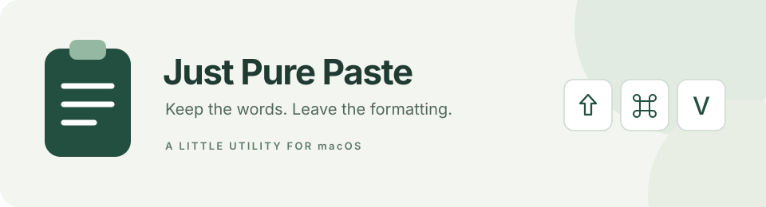

<p align="center">
  
</p>

<h1 align="center">Just Pure Paste</h1>

<p align="center">
  A small macOS menu bar app for pasting plain text with one shortcut.<br>
  Copy as usual. Press <kbd>⇧ Shift</kbd> + <kbd>⌘ Command</kbd> + <kbd>V</kbd>. Keep writing.
</p>

<p align="center">
  <a href="https://github.com/kqcoxn/just-mac-pure-paste/actions/workflows/macos.yml"></a>
  
  
</p>

<p align="center">
  <strong>English</strong> · <a href="README.zh-CN.md">简体中文</a>
</p>

<p align="center">
  <a href="https://github.com/kqcoxn/just-mac-pure-paste/releases"><strong>Download</strong></a> ·
  <a href="#quick-start">Quick start</a> ·
  <a href="#build-from-source">Build from source</a> ·
  <a href="https://github.com/kqcoxn/just-mac-pure-paste/issues">Report an issue</a>
</p>

---

## A simpler paste

Copied text often brings fonts, colors, and other source formatting along with it. Just Pure Paste turns the clipboard’s text into plain text, then sends a paste command to the foreground app. The destination decides how to display it.

| | What you get |
| --- | --- |
| **One shortcut** | Start with **⇧⌘V**, or record your own global shortcut. Your choice survives restarts. |
| **Your words, intact** | Preserve spaces, line breaks, Unicode, and emoji while removing source formatting. |
| **Quiet by design** | Optional menu bar icon; the Dock icon appears while Settings is visible. Closing Settings keeps it running. |
| **Local clipboard handling** | No clipboard history, content uploads, or cloud sync. Clipboard reading happens when you trigger the shortcut. |
| **Update awareness** | Checks GitHub for stable releases and links to the download page when an update is available. |

> **Clipboard behavior:** after conversion, the clipboard stays plain text. The original rich text is not restored. Empty content, image-only copies, and file copies are left unchanged.

## Quick start

### 1. Download and open

Requires **macOS 14 or later**. Pick the ZIP for your Mac from [GitHub Releases](https://github.com/kqcoxn/just-mac-pure-paste/releases):

| Your Mac | Archive suffix |
| --- | --- |
| Apple Silicon — M-series | `macos-arm64.zip` |
| Intel | `macos-x86_64.zip` |

Unzip, move **Just Pure Paste.app** to Applications, and open it. If no release is available yet, [build it locally](#build-from-source). Development builds are also available from successful [Actions runs](https://github.com/kqcoxn/just-mac-pure-paste/actions/workflows/macos.yml).

The app currently uses ad-hoc signing and is **not Apple-notarized**. macOS may require you to allow it in **System Settings → Privacy & Security**. See the [distribution notes](docs/ci-release.md#签名与验证范围) for details.

### 2. Allow Accessibility access

Settings opens whenever you launch or reopen the app. **The app interface is currently in Simplified Chinese**; this README’s language switch changes the documentation only.

1. Click **请求授权** (Request permission) in the app.
2. Open **System Settings → Privacy & Security → Accessibility** and enable **Just Pure Paste**. Add the `.app` manually if it is missing.
3. Return to the app and click **重新检查** (Check again), then confirm **已授权** (Authorized).
4. If macOS separately asks for clipboard access, allow it to continue pasting.

Accessibility access lets the app send the paste keystroke to your target app.

### 3. Copy, then paste

Copy some text, focus the destination input field, and press **⇧⌘V**. Release the keys so the app can send the paste command.

Use the menu bar’s clipboard icon → **设置…** (Settings) to change the shortcut. Clear it to pause the hotkey, or click **恢复默认** (Restore default) to return to ⇧⌘V. If another app uses the same shortcut, choose a different combination. Regular **⌘V** remains unchanged and cannot be assigned to this tool.

Closing Settings leaves the app running. Command-dragging the menu bar icon away only hides it; the hotkey keeps working, and the hidden state persists across launches. Open the app again to show Settings, where **在菜单栏显示图标** restores the icon. To stop the app, choose **退出 Just Pure Paste** (Quit) from the menu bar or press ⌘Q in Settings.

## Updates

Automatic checks are enabled by default: the app checks on its first run, then when at least **24 hours** have passed since the last request while it is running. You can turn this off in Settings and still use **检查更新** (Check for updates) manually. Manual requests are limited to once a minute; request times and discovered updates persist across restarts.

Only public, stable releases from this repository are checked. When a newer version is found, the menu bar icon changes to a download indicator and offers the release page. **Downloads and installation are manual.** Failed checks only update the status; they do not interrupt pasting.

Update requests contain no account token, clipboard content, or records of which apps you use. There is no clipboard history, cloud sync, or launch-at-login feature.

## Build from source

Use **Swift 6.2+**, Python 3, and the project’s build scripts on macOS. CI uses Xcode 26.2. The Command Line Tools path additionally requires an installed macOS 26 SDK.

```bash
git clone https://github.com/kqcoxn/just-mac-pure-paste.git
cd just-mac-pure-paste
./scripts/swift.sh test
./scripts/setup-dev-signing.sh  # one-time setup
./scripts/dev.sh               # build, install, and launch
```

Local development uses a persistent self-signed code-signing certificate, with its private key kept in the login keychain, never in the repository. The one-time setup may prompt for a keychain operation; subsequent runs reuse the identity. Set `DEV_SIGNING_IDENTITY` to an existing development certificate name if preferred.

For daily use, run `./scripts/dev.sh`. It builds and verifies the app before stopping the old development copy, installing to `~/Applications/Just Pure Paste Dev.app`, and launching it. The development bundle ID is `com.justmacpurepaste.app.dev`; grant Accessibility access to this copy once. Keeping the certificate and app identity stable lets macOS recognize subsequent builds. Do not run the release and development copies together, as their shortcuts can conflict. Keep the certificate and private key; changing them may require reauthorization.

`./scripts/build-app.sh` defaults to building only the development bundle at `dist/development/Just Pure Paste Dev.app`. Use `./scripts/build-app.sh --release` for the ad-hoc signed, unnotarized release bundle at `dist/Just Pure Paste.app` with ID `com.justmacpurepaste.app`. CI explicitly uses release mode and does not use your local certificate. Release updates may still need Accessibility reauthorization; allowing a downloaded app to open is separate from granting Accessibility access.

<details>
<summary><strong>Build compatibility and dependency handling</strong></summary>

[KeyboardShortcuts](https://github.com/sindresorhus/KeyboardShortcuts) is pinned to **3.1.0**, with its revision recorded in `Package.resolved`.

Command Line Tools lacks the SwiftUI macro plugins used by this dependency. In that environment, `scripts/swift.sh` uses the installed macOS 26 SDK and SwiftPM’s native build system, expands `@Entry` into an equivalent `EnvironmentKey`, and removes three design-only `#Preview` blocks from the disposable `.build` checkout. Shortcut logic and the pinned dependency version are unchanged. Cleaning the cache causes the script to reapply these adjustments.

Full Xcode builds do not need those macro adjustments. In all environments, the script also adjusts dependency resource lookup so localization bundles can live in `Contents/Resources` and pass signature verification. Use the scripts instead of direct `swift build` / `swift test` in the CLT environment. They do not install SDKs or change system tools.

</details>

## Notes and troubleshooting

| Situation | What to check |
| --- | --- |
| Nothing is pasted | Confirm Accessibility access and focus an editable field. Read the status in the menu bar or Settings after the failure sound. |
| Permission stops working after an update | Ad-hoc signed apps may need Accessibility permission granted again after being rebuilt or moved. |
| An operation is cancelled | The app waits up to one second for modifier keys to be released. Switching apps or changing the clipboard during the operation cancels it; there is no automatic retry. |
| Status says **已发送粘贴** | This means “Paste sent.” It confirms the keystroke was posted, not that the target field accepted it. |
| A particular app behaves differently | Secure input fields, remote desktops, and other special inputs may not accept simulated keystrokes. |

<details>
<summary><strong>Text conversion and clipboard limitations</strong></summary>

The app reads a plain-text representation first and can extract text from RTF. HTML-only content without a text representation is not parsed.

macOS provides no atomic compare-and-swap for the clipboard. The app checks for changes immediately before writing, but a small race window remains. A failed write, or a target/permission change immediately after writing, can leave the original formatting removed even if no paste is sent. The clipboard is not restored and the operation is not retried automatically.

</details>

## Project documentation

The detailed engineering documents below are currently in Chinese.

| Document | Contents |
| --- | --- |
| [Project plan](docs/project-plan.md) | Scope, architecture, and behavior decisions |
| [CI and releases](docs/ci-release.md) | Apple Silicon / Intel builds, version tags, archives, and checksums |
| [Verification record](docs/verification.md) | Completed checks, tested environments, and pending manual validation |

CI tests and packages both architectures on pushes to `main`, pull requests, and manual runs. Pushing a `v*` version tag publishes a GitHub Release after both builds succeed; prerelease tags produce prereleases. See the release guide for exact steps.

**Validation scope:** local automated tests, arm64 builds, and packaging have passed. Real paste checks in Safari, VS Code, WeChat, and WPS are pending Accessibility authorization; macOS 14 and Intel runtime compatibility are also pending validation. See the record above rather than assuming universal app compatibility.

---

Built with SwiftUI, AppKit, and [KeyboardShortcuts](https://github.com/sindresorhus/KeyboardShortcuts).
